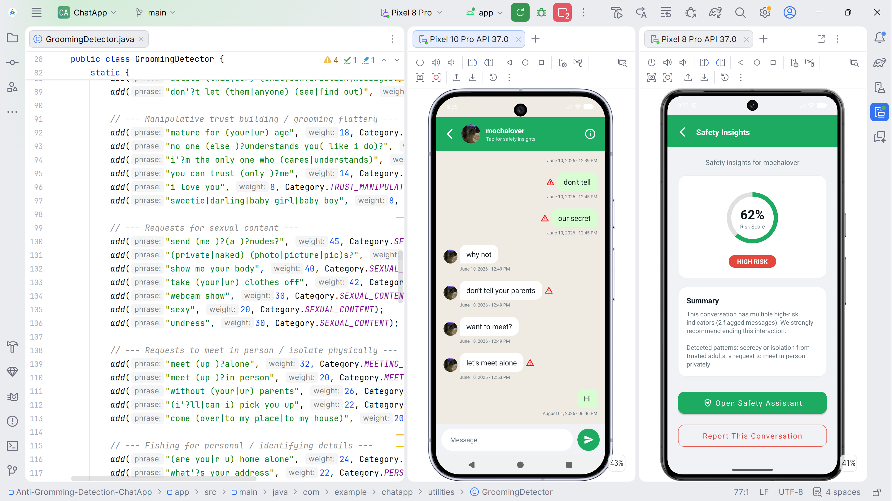

# Anti-Grooming ChatApp

The **Anti-Grooming ChatApp** is a secure messaging platform designed to protect users from grooming-related communications. By leveraging real-time detection and AI-powered support, the system creates a safer environment for digital interaction.

The significance of this application extends beyond individual protection. By logging flagged incidents to a secure cloud backend (Firebase Firestore), the system creates an auditable record that can support institutional reporting, counselling referrals, and policy development.

## 🚀 Demo

[](https://github.com/zilitye/Anti-Grooming-ChatApp/releases/download/v2.0.0/app-release.apk)

Install and run `app-release.apk`. Requires **Android 7.0 (Nougat)** or higher.



## ✨ Features

1.  **Real-time Grooming Detection**: Analyzes outgoing messages for language patterns associated with grooming behavior before they are sent, using a rule-based keyword scoring engine.
2.  **AI-Powered Safety Hub**: A dedicated Safety Assistant powered by **OpenAI**, offering users compassionate, context-aware guidance, reporting pathways, and emotional support.
3.  **Risk Dashboard & Reporting**: Visualizes the cumulative risk profile of a conversation over time and provides a structured mechanism for reporting unsafe interactions.
4.  **Secure Communication**: Built on Firebase for reliable, real-time messaging and cloud storage.

## 🛠️ Tech Stack

| Layer | Technology |
| :--- | :--- |
| **Language** | Java (Android SDK) |
| **UI** | XML layouts, View Binding, RecyclerView |
| **Database** | Firebase Firestore |
| **Messaging** | Firebase Cloud Messaging (FCM) |
| **AI / LLM** | OpenAI API |
| **HTTP Client** | Retrofit 2 |
| **Markdown Rendering** | Markwon |

## ⚙️ Setup & Installation

### 1. Clone the Repository
```bash
git clone https://github.com/zilitye/Anti-Grooming-ChatApp.git
cd Anti-Grooming-ChatApp
```

### 2. Connect Firebase
1. Create a project at the [Firebase Console](https://console.firebase.google.com/).
2. Enable **Firestore Database** and **Cloud Messaging**.
3. Download `google-services.json` and place it in the `app/` directory.
4. Go to **Project Settings** > **Service Accounts**.
5. Generate a new private key (`service_account.json`) and place it in `app/src/main/assets/`.

### 3. Configure API Keys
Open `app/src/main/java/com/example/chatapp/utilities/Constants.java` and update the following:

```java
public static final String OPENAI_API_KEY = "YOUR_OPENAI_API_KEY_HERE";
```

### 4. Build and Run
Open the project in **Android Studio**, sync Gradle, and run the app on your device or emulator.

## 🛡️ Safety & Privacy
All flagged incidents are stored securely in Firebase Firestore to maintain an auditable trail for safety purposes. Users can access the **Safety Hub** at any time for resources and assistance.
