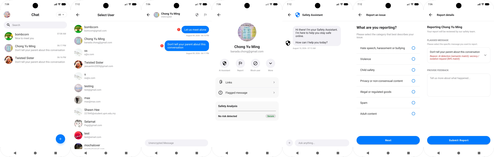

## Anti-Grooming ChatApp

The **Anti-Grooming ChatApp** is a secure messaging platform designed to protect users from grooming-related communications. By leveraging real-time semantic detection and AI-powered support, the system creates a safer environment for digital interaction.

The significance of this application extends beyond individual protection. By logging flagged incidents to a secure cloud backend (Firebase Firestore), the system creates an auditable record that can support institutional reporting, counselling referrals, and policy development.

## Demo

[](https://github.com/zilitye/Anti-Grooming-ChatApp/releases/download/v2.0.0/app-release.apk)

Install and run `app-release.apk`. Requires **Android 7.0 (Nougat)** or higher.




## Features

1. **Real-time Semantic Detection (On-Device NLP)**: Unlike traditional keyword filters, the app uses a **local NLP embedding model** (`all-MiniLM-L6-v2`) to analyze message intent. It calculates the cosine similarity between outgoing messages and known grooming tactics entirely on-device, catching paraphrased or subtle grooming attempts. Every message is converted into a high-dimensional vector (embedding) using a quantized transformer model running via **ONNX Runtime**. This allows the app to detect grooming tactics based on *meaning* rather than just specific words, maintaining privacy by processing data locally.

2. **Rule-Based Fallback**: A keyword scoring engine provides a fast, initial layer of protection while the NLP model initializes.

## Tech Stack

| Layer | Technology |
| :--- | :--- |
| **Language** | Java & Kotlin (Android SDK) |
| **UI** | XML layouts, View Binding, RecyclerView |
| **Database** | Firebase Firestore |
| **Messaging** | Firebase Cloud Messaging (FCM) |
| **AI / LLM** | OpenAI API (Assistant) |
| **On-Device NLP** | ONNX Runtime & Sentence Embeddings (`all-MiniLM-L6-v2`) |
| **HTTP Client** | Retrofit 2 |
| **Markdown Rendering** | Markwon |

## Setup & Installation

### 1. Clone the Repository
```bash
git clone https://github.com/zilitye/Anti-Grooming-ChatApp.git
cd Anti-Grooming-ChatApp
```

### 2. Connect Firebase
1. Create a project at the [Firebase Console](https://console.firebase.google.com/).
2. Enable **Firestore Database** and **Cloud Messaging**.
3. Download `google-services.json` and place it in the `app/` directory.
4. Go to **Project Settings** > **Service Accounts**.
5. Generate a new private key (`service_account.json`) and place it in `app/src/main/assets/`.

### 3. Configure API Keys
Open `app/src/main/java/com/example/chatapp/utilities/Constants.java` and update the following:

```java
public static final String OPENAI_API_KEY = "YOUR_OPENAI_API_KEY_HERE";
```

### 4. Build and Run
Open the project in **Android Studio**, sync Gradle, and run the app on your device or emulator.

